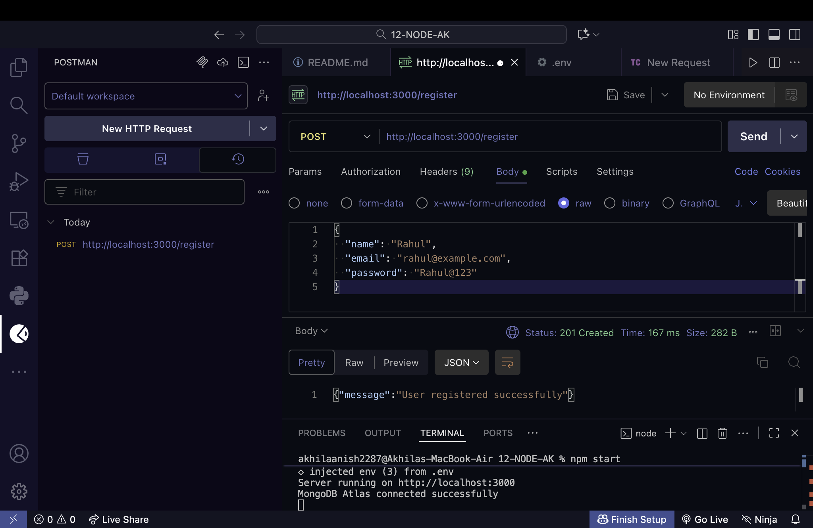
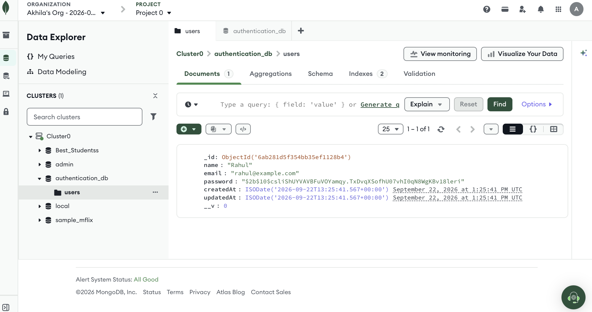
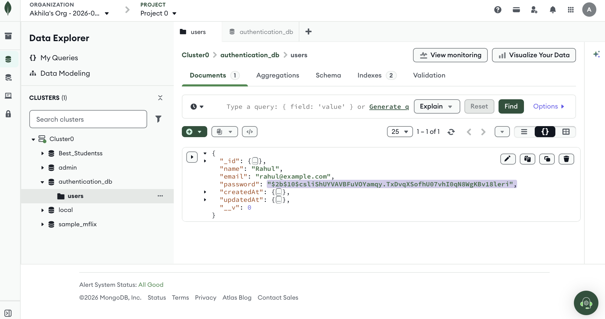
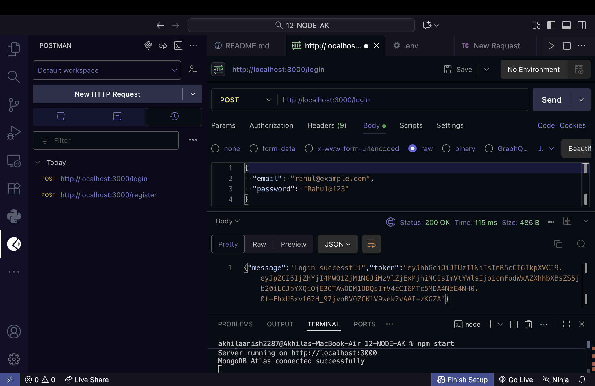
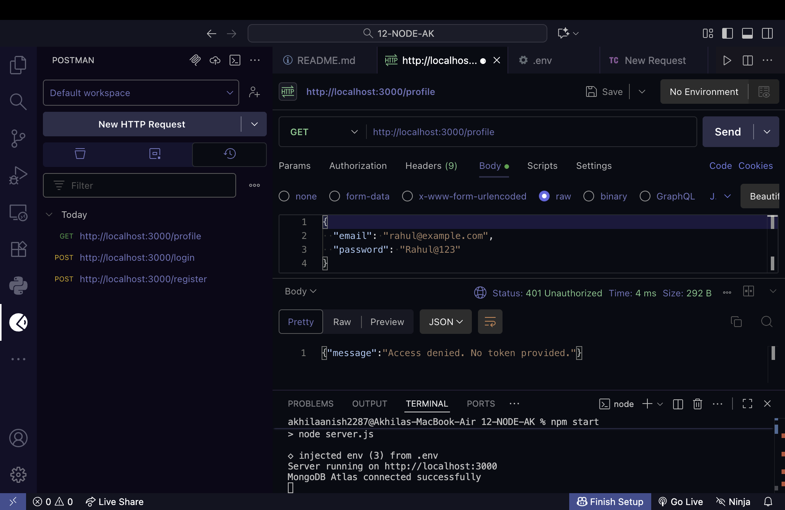
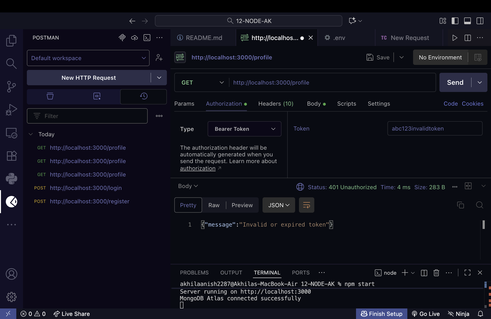
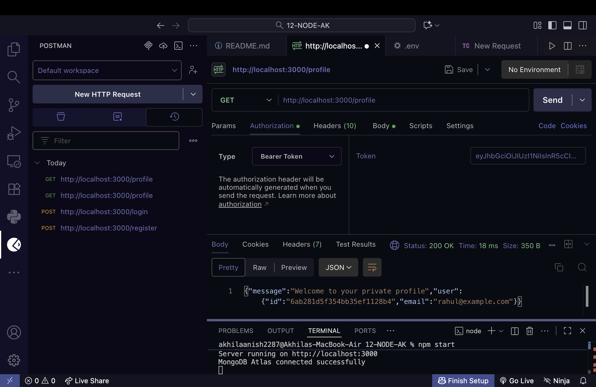

# Node.js Authentication System

**Student:** Akhila Anish Das  
**Project:** User Authentication using Node.js, Express.js, MongoDB Atlas and JWT

## Features

- User registration
- Password hashing using bcrypt
- User login
- JWT token generation
- Protected profile route
- MongoDB Atlas database
- Authentication middleware

## API Endpoints

| Method | Endpoint | Description |
|---|---|---|
| POST | `/register` | Register a new user |
| POST | `/login` | Login and receive JWT |
| GET | `/profile` | Access protected profile |

## Screenshots

### 1. Successful Registration

### 2. User Stored in MongoDB Atlas

### 3. Hashed Password

### 4. Successful Login

### 5. JWT Token Received

### 6. Profile Without Token

### 7. Profile With Invalid Token

### 8. Profile With Valid Token

